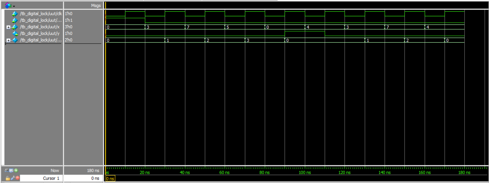
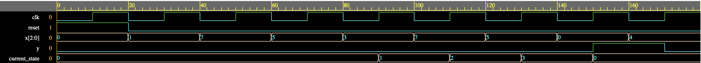
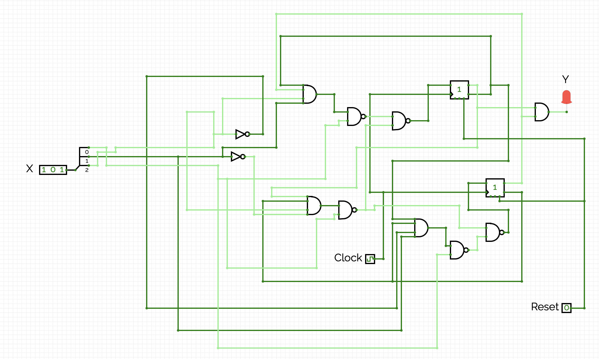
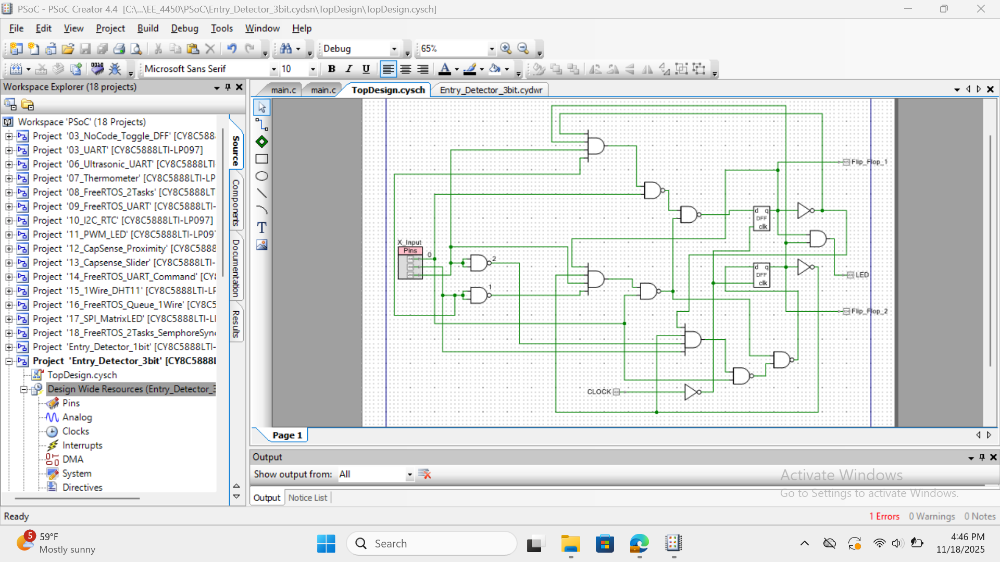
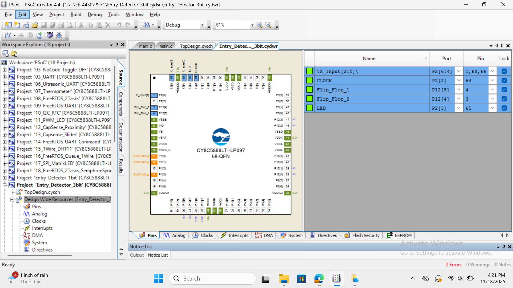

# Digital-Lock-System (3-bit Input Moore FSM)
This project presents the design and implementation of a Moore finite state machine (FSM)-based digital lock system using Verilog. The system is configured to unlock only upon receiving a specific sequence of 3-bit binary inputs. The design was verified using a testbench that simulated the lock’s behavior across eight different test cases. These cases included both valid and invalid input sequences to ensure the system transitions correctly between states and behaves as expected under all conditions.

## 🔧 Features
- Unlocks only on a **precise 3-input sequence**: `011 → 111 → 101`
- Resettable FSM using a `reset` signal
- `y` output (e.g., LED) goes HIGH when unlocked
- Verified with a comprehensive testbench and waveform simulation

## FSM States and Transitions

| Current State | Input `x` | Next State | Output `y` | 
|---------------|--------|------------|---------------|
| S0            | 011    | S1         | 0             |
| S0            | NOT 011| S0         | 0             |
| S1            | 111    | S2         | 0             |
| S1            | NOT 111| S0         | 0             |
| S2            | 101    | S3         | 0             |
| S2            | NOT 101| S0         | 0             |
| S3            | X X X  | S0         | 1             | 

## 📸 Simulation Waveform

This waveform shows the FSM correctly transitioning through each state when the correct sequence is entered, asserting y = 1 at the end. It also demonstrates how the FSM resets to the initial state when an invalid input is detected mid-sequence:

This waveform shows the FSM receiving incorrect inputs at first, keeping the lock in its initial state. This confirms it correctly rejects invalid sequences. When the correct input sequence is entered afterward, the FSM transitions states and the y output goes high.

## Moore FSM Schematic
The FSM unlocks on the input sequence: 011 → 111 → 101. This schematic was created in CircuitVerse. 
 

## Top Design in PSoC Creator
 

## PSoC Pins
Below are the pins used for the digital lock sytem on the PSoC5LP. 
Four digital inputs were used and three digital outputs were used.
Two digital outpts were used for the outputs of the D flip flop's to 
see the current state. 

 

## How to Run

1. Open the project in **EDA Playground**:  
   👉 [https://www.edaplayground.com/x/hMpk](https://www.edaplayground.com/x/EgBS)

2. Click **"Run"** to simulate the testbench.

3. **Make sure "Open EPWave after run" is checked** under Tools & Simulators

## 🎥 Project Demo

Click the image above to watch the full demo
