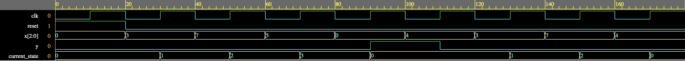
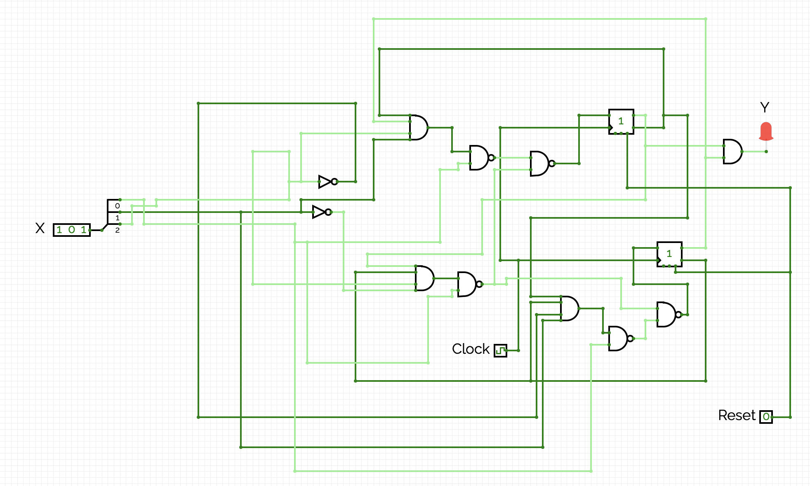

# Digital-Lock-System (3-bit Input Moore FSM)
This project presents the design and implementation of a Moore finite state machine (FSM)-based digital lock system using Verilog. The system is configured to unlock only upon receiving a specific sequence of 3-bit binary inputs. The design was verified using a testbench that simulated the lock’s behavior across eight different test cases. These cases included both valid and invalid input sequences to ensure the system transitions correctly between states and behaves as expected under all conditions.

## 🔧 Features
- Unlocks only on a **precise 3-input sequence**: `011 → 111 → 101`
- Resettable FSM using a `reset` signal
- `y` output (e.g., LED) goes HIGH when unlocked
- Verified with a comprehensive testbench and waveform simulation

## FSM States and Transitions

| Current State | Input `x` | Next State | Output `y` | 
|---------------|--------|------------|---------------|
| S0            | 011    | S1         | 0             |
| S0            | NOT 011| S0         | 0             |
| S1            | 111    | S2         | 0             |
| S1            | NOT 111| S0         | 0             |
| S2            | 101    | S3         | 0             |
| S2            | NOT 101| S0         | 0             |
| S3            | X X X  | S0         | 1             | 

## 📸 Simulation Waveform

The waveform shows the FSM correctly transitioning and asserting the output `y` once the correct sequence is received and shows when an invalid input is received, where the FSM correctly resets to the initial state:

## Moore FSM Schematic
The FSM unlocks on the input sequence: 011 → 111 → 101.

