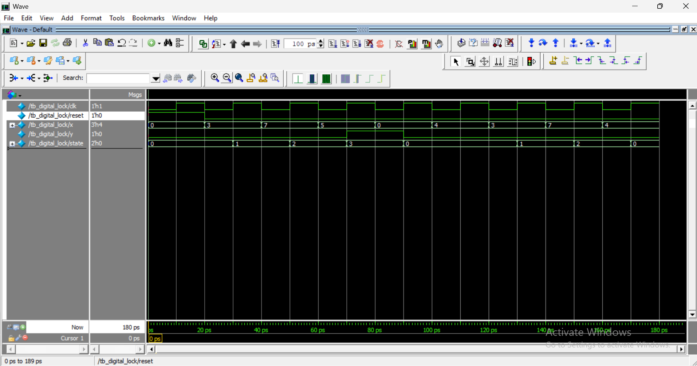
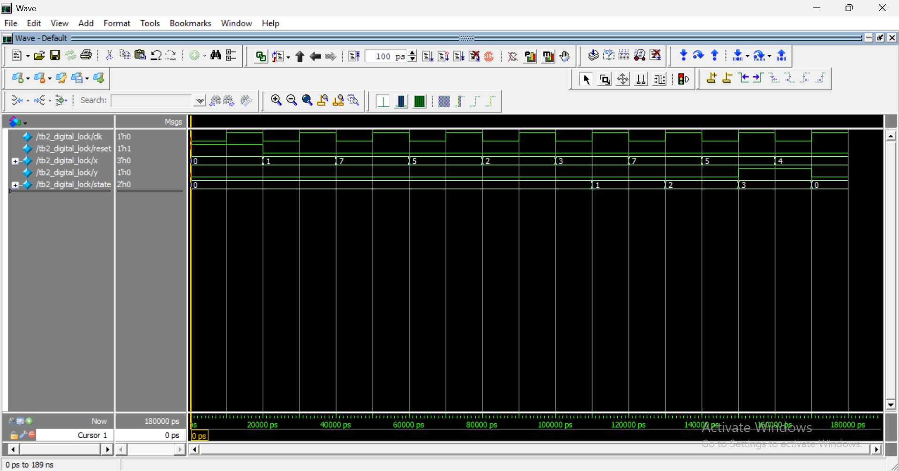
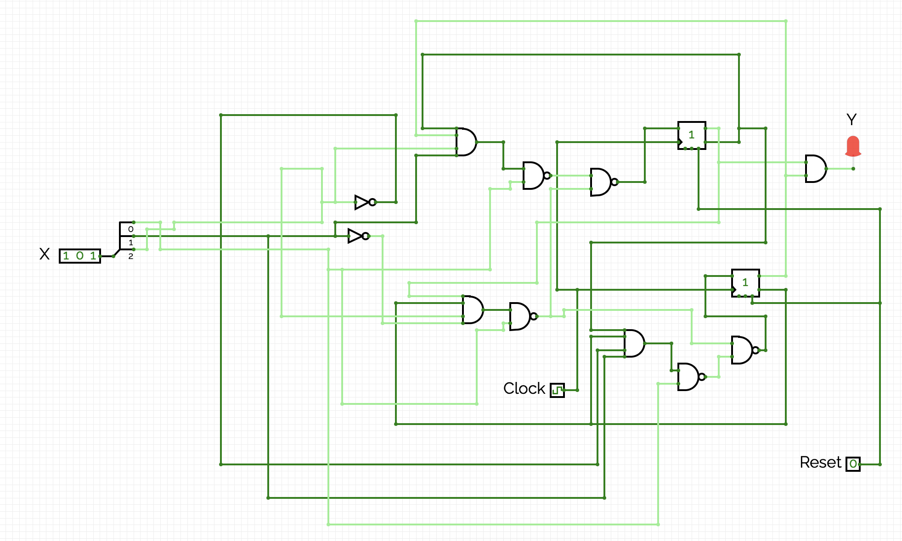

# Digital-Lock-System (3-bit Input Moore FSM)
This project presents the design and implementation of a Moore finite state machine (FSM)-based digital lock system using Verilog. The system is configured to unlock only upon receiving a specific sequence of 3-bit binary inputs. The design was verified using a testbench that simulated the lock’s behavior across eight different test cases. These cases included both valid and invalid input sequences to ensure the system transitions correctly between states and behaves as expected under all conditions. The design was fully implennted on a Max DE-10 Lite FPGA Board.

## 🔧 Features
- Unlocks only on a **precise 3-input sequence**: `011 → 111 → 101`
- Resettable FSM using a `reset` signal
- `y` output (e.g., LED) goes HIGH when unlocked
- Verified with a comprehensive testbench and waveform simulation
- Hardware implementation in PSoC Creator behaves exactly like the Verilog simulation

## FSM States and Transitions

| Current State | Input `x` | Next State | Output `y` | 
|---------------|--------|------------|---------------|
| S0            | 011    | S1         | 0             |
| S0            | NOT 011| S0         | 0             |
| S1            | 111    | S2         | 0             |
| S1            | NOT 111| S0         | 0             |
| S2            | 101    | S3         | 0             |
| S2            | NOT 101| S0         | 0             |
| S3            | X X X  | S0         | 1             | 

## FPGA Pin Mapping 

### Inputs (Switches)

| Switch | Signal | Width | Description |
|-------|--------|-------|------------|
| SW[0] | Reset | 1-bit | Resets FSM to initial state|
| SW[3:1] | x | 3-bit | 3-bit input  |

### Input (Pushbutton)

| Clock | Signal | Description |
|-------|--------|--------------|
| MAX10_CLK1_50 | clk   | clock signal @ 50MHz |

### Outputs (LEDs)

| LED | Signal | Width | Description |
|----|--------|-------|------------|
| LEDR[0] | y | 1-bit | Output when correct sequence is entered (3 → 7 → 5) |
| LEDR[3:2] | state | 2-bit | Display current FSM state |

## 📸 Simulation Waveform

This waveform shows the FSM correctly transitioning through each state when the correct sequence is entered, asserting y = 1 at the end. It also demonstrates how the FSM resets to the initial state when an invalid input is detected mid-sequence:

This waveform shows the FSM receiving incorrect inputs at first, keeping the lock in its initial state. This confirms it correctly rejects invalid sequences. When the correct input sequence is entered afterward, the FSM transitions states and the y output goes high.

## FPGA Implementation 

In this image the FSM transitions to State 1 after receiving the first correct input (3) via onboard switches. The LED output reflects the state change, confirming successful entry of the first digit.

In this image the FSM advances to State 2 after the second correct input (7) is entered using the switches. The LEDs update to indicate the new state. 

In this image the FSM reaches the final state after the complete sequence (3 → 7 → 5) is entered through the switches. The output signal goes HIGH, activating an LED to indicate the lock has been successfully opened.

## Moore FSM Schematic
The FSM unlocks on the input sequence: 011 → 111 → 101. This schematic was created in CircuitVerse. 
 

## How to Run

1. Open the project in **EDA Playground**:  
   👉 [https://www.edaplayground.com/x/hMpk](https://www.edaplayground.com/x/EgBS)

2. Click **"Run"** to simulate the testbench.

3. **Make sure "Open EPWave after run" is checked** under Tools & Simulators

## 🎥 Project Demo

Click the image above to watch the full demo
